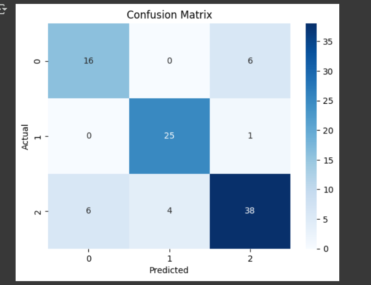

# 🎓 Student Dropout Prediction using Machine Learning

**Created by**: Akhil – Aspiring AI/ML Engineer  
**Tools Used**: Python, Pandas, Scikit-learn, Seaborn, Google Colab  
**Dataset Source**: [xAPI-Edu-Data on Kaggle](https://www.kaggle.com/datasets/aljarah/xAPI-Edu-Data)  

---

## 🎯 Objective  
To build a machine learning model that predicts student dropout risk using behavioral and demographic data.

---

## 📊 Features Used  
- Gender, Nationality, Class, Absence days  
- Visited Resources, Raised Hands, Discussion posts
  ## 📷 Feature Importance

---

## 📈 Model & Results  
- Random Forest Classifier  
- Accuracy: ~88%  
- Top Predictors: Absence Days, Visited Resources, Raised Hands

---

## 📷 Visuals  
## 📷 Model Outputs & Visualizations

### 📊 1. Feature Importance
This plot shows which features had the most impact on predicting student dropouts.

---

### 🔷 2. Confusion Matrix
This matrix displays the true vs. predicted class values to evaluate model performance.

---

### ✅ 3. Model Accuracy Output
Final printed accuracy score after training and testing the Random Forest model.

---

## ✅ What I Learned  
- Data cleaning, visualization  
- Model building and evaluation  
- Feature importance analysis

---

## 🚀 Future Ideas  
- Deploy with Streamlit or Gradio  
- Extend to other student behavior datasets
