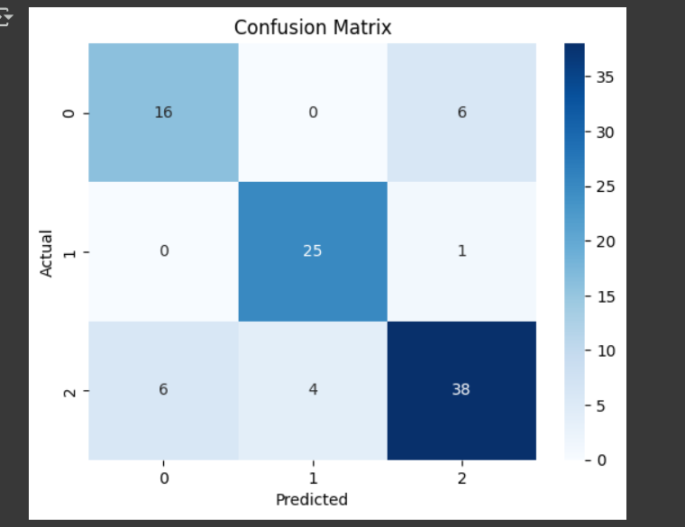
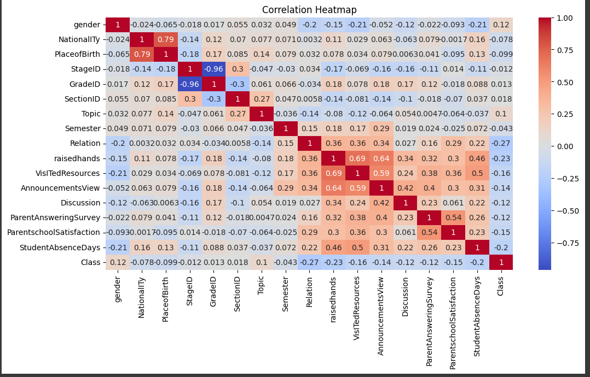
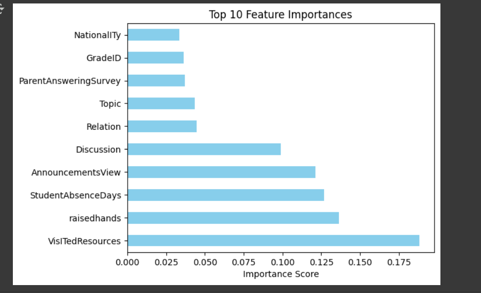

# 🎓 Student Dropout Prediction using Machine Learning

**Created by**: Akhil – Aspiring AI/ML Engineer  
**Tools Used**: Python, Pandas, Scikit-learn, Seaborn, Google Colab  
**Dataset Source**: [xAPI-Edu-Data on Kaggle](https://www.kaggle.com/datasets/aljarah/xAPI-Edu-Data)  

---

## 🎯 Objective  
To build a machine learning model that predicts student dropout risk using behavioral and demographic data.

---

## 📊 Features Used  
- Gender, Nationality, Class, Absence days  
- Visited Resources, Raised Hands, Discussion posts
  ## 📷 Feature Importance

---

## 📈 Model & Results  
- Random Forest Classifier  
- Accuracy: ~88%  
- Top Predictors: Absence Days, Visited Resources, Raised Hands

---

## 📷 Model Outputs & Visualizations

### 📊 1. Confusion Matrix  
Compares predicted vs actual values to evaluate classification accuracy.

---

### 📌 2. Correlation Heatmap  
Displays relationships between all features to find highly correlated variables.

---

### 🌡️ 3.Feature Importance  
Shows the most important factors contributing to student dropout predictions.
 

---

## ✅ What I Learned  
- Data cleaning, visualization  
- Model building and evaluation  
- Feature importance analysis

---

## 🚀 Future Ideas  
- Deploy with Streamlit or Gradio  
- Extend to other student behavior datasets

